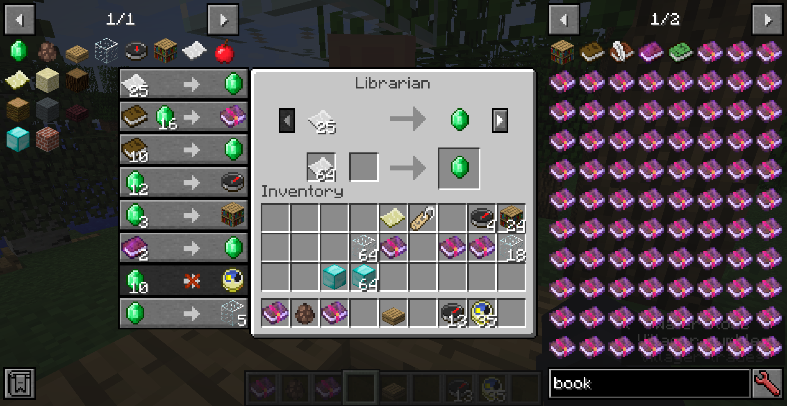

# Better Trading Menu
Enhance the villager GUI for legacy versions of Minecraft.  

This mod adds a trades list to the left side of villager GUI, like mc1.14+.  
- Click a trade to select it and move items to required slots  
- Scroll with mouse wheel when more than 8 trades available  
- The items shown on the list can be searched for recipes/uses in JEI with hotkeys  